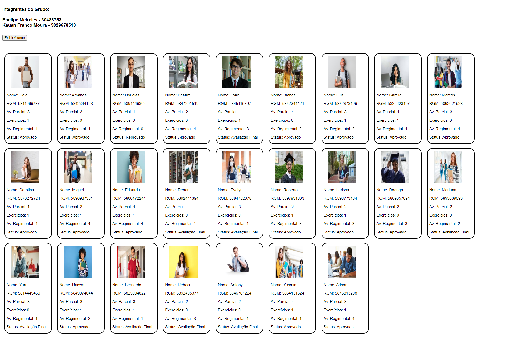

<h1 align="center"> Projeto Programação Web - Faculdade </h1>

  

 

  

## 🚀 Tecnologias

Esse projeto foi desenvolvido com as seguintes tecnologias:

- HTML e CSS
- JavaScript e JSON

## 💻 Projeto

Esse foi um projeto da faculdade para criar um site que possa mostrar as notas de alguns alunos.

## Licença

Esse projeto está sob a licença MIT.

---
